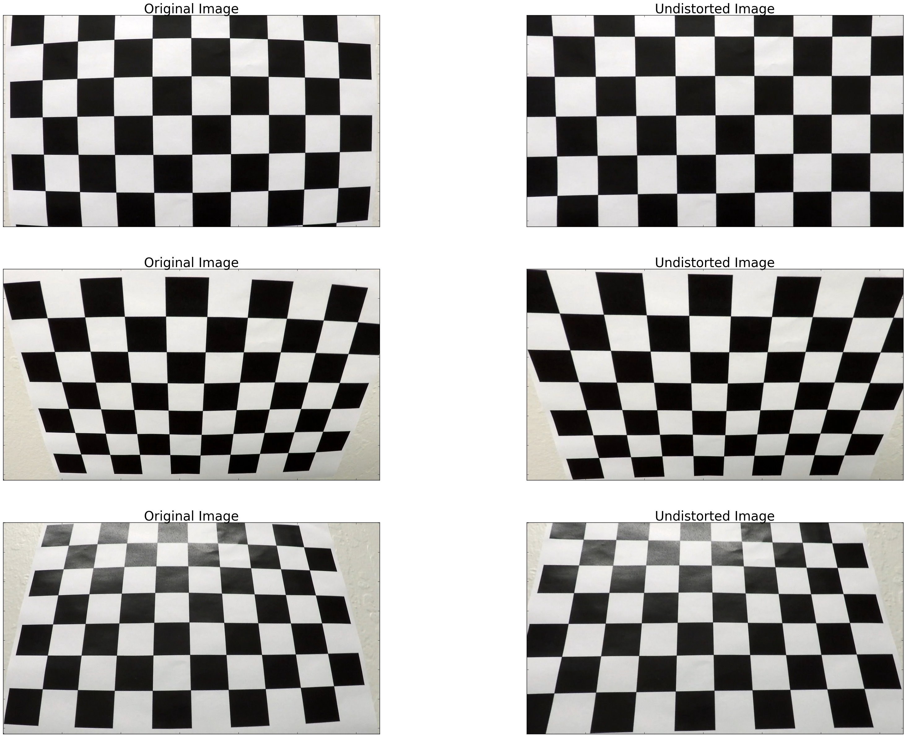
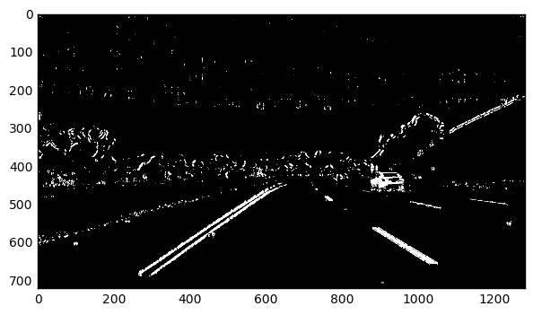
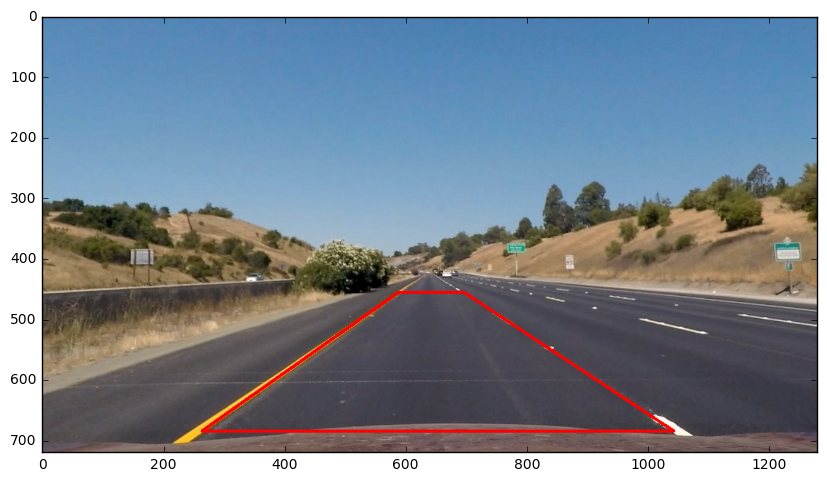
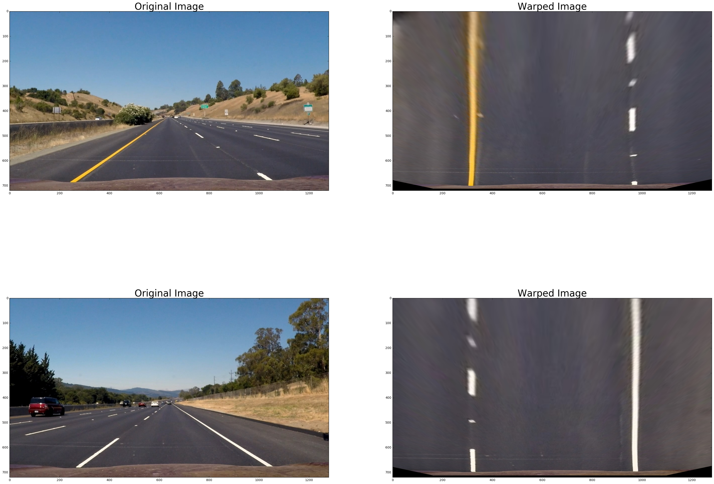
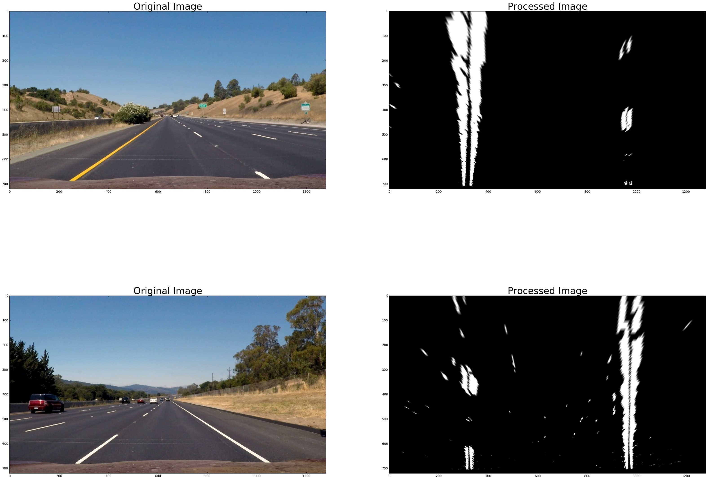
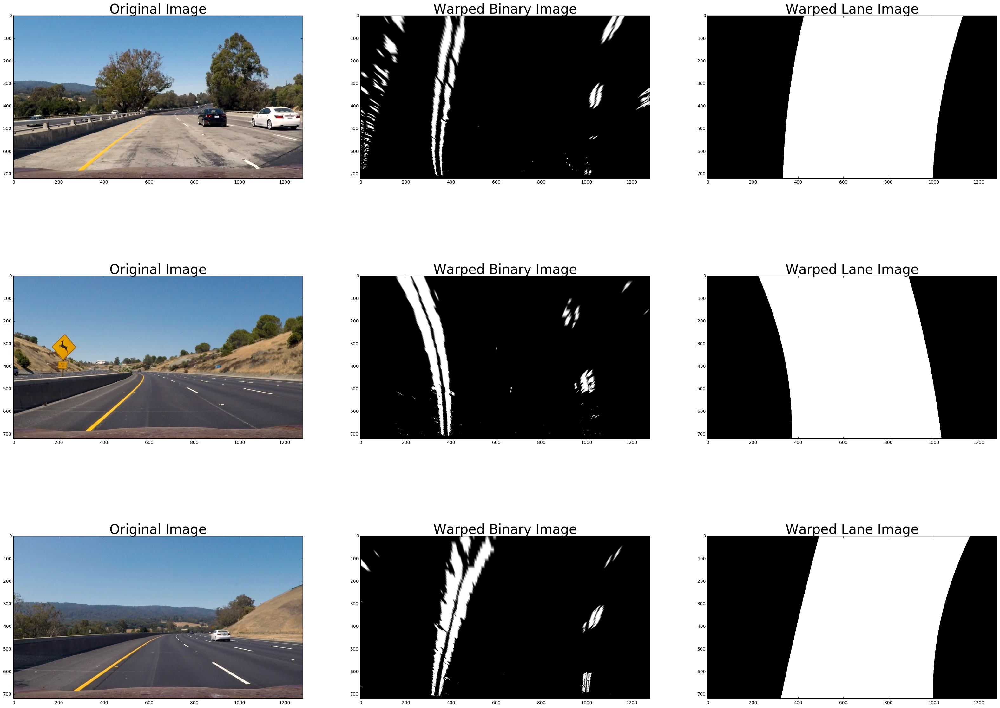

## Advanced Lane Finding

The goals / steps of this project are the following:

* Compute the camera calibration matrix and distortion coefficients given a set of chessboard images.
* Apply a distortion correction to raw images.
* Use color transforms, gradients, etc., to create a thresholded binary image.
* Apply a perspective transform to rectify binary image ("birds-eye view").
* Detect lane pixels and fit to find the lane boundary.
* Determine the curvature of the lane and vehicle position with respect to center.
* Warp the detected lane boundaries back onto the original image.
* Output visual display of the lane boundaries and numerical estimation of lane curvature and vehicle position.


Camera calibration
---

I calibrated camera with chess board images, using `cv2.calibrateCamera()` and `cv2.undistort()` functions. Here is the result of calibration, undistorted chess board images and lane images.

* Chess board images

<p align="center">
  
</p>

* Lane images

<p align="center">
  
</p>


Color transform
---

I applied five factors for my filter to generate a binary image.

* RGB minimum values
* Sobel threshold X
* Sobel threshold Y
* Gradient magnitude
* Gradient direction

The parameters of the filter were tuned using interactive python interface. The result of color transform is shown below. In the image, two lane lines are clearly marked.

<p align="center">
  
</p>


Perspective transform
---

To get appropriate matrix for the perspective transform with `cv2.getPerspectiveTransform()`, I used images of the straight lines. Using interactive python interface, I marked four corners to make source points of the perspective transform. The result is shown in the image below.

<p align="center">
  
</p>

Then I selected destination points which can transform source points to the points of straight lines. This resulted in the following source and destination points.

| Source        | Destination   | 
|:-------------:|:-------------:| 
| 263, 456      | 320, 20        | 
| 587, 685      | 320, 700      |
| 1042, 685     | 960, 700      |
| 696, 456      | 960, 20        |

A matrix for perspective transform was derived using `cv2.warpPerspective()`, and here is the result of the perspective transform of the test images. In the images, birds-eye view of the straight lines were successfully obtained.

<p align="center">
  
</p>


Rectified binary image
---

Applying all (camera calibration, color transform, and perspective transform), rectified binary images to detect lane lines were generated.

<p align="center">
  
</p>


Lane detection
---

Using rectified binary images, lane detection can be carried out. Along the X axis, a histogram of the number of the pixels was generated and two peaks of the histogram was selected for the base positions to find lane lines. The rectangle kernel (green rectangles) was extended toward y axis, starting from the base positions. The kernels were following the dense clusters of the pixels, and the pixels within the kernel were marked (red and blue pixels). Finally, quadratic polynomial fitting was done using the marked pixels (yellow lines), and the quadratic equations of the left and right lanes were obtained.
Lane detection in the video can be done fastly. Considering that the video is the flow of images, lane lines are changing conitnuously through the images, so lane line pixels can be searched around the detected lines from the previous image. But if lane detection has problem in the previous image, this method will return bad searching area. To prevent this, sanity check of the base points is needed.

<p align="center">
  
</p>

Between the fitting lines of the two equations, detected lane was marked as shown in images below.

<p align="center">
  
</p>


Lane marking
---

Detected lane was unwarped using reversed perspective transform, and marked on the camera images like below.

<p align="center">
  
</p>


Curvature and vehicle position
---

Considering the real length of the pixel,
```
ym_per_pix = 30/720 # meter
xm_per_pix = 3.7/700 # meter
```
the lane pixels found in the previous stage were transformed to the real world scale, and the quadratic equations of the lane lines were derived using transformed pixels.
```
left_fit_cr = np.polyfit(lefty*ym_per_pix, leftx*xm_per_pix, 2)
right_fit_cr = np.polyfit(righty*ym_per_pix, rightx*xm_per_pix, 2)
```
Curvature of the each line at the base y was calculated, using the equation below.
```
left_curverad = ((1 + (2*left_fit_cr[0]*image_y_size*ym_per_pix + left_fit_cr[1])**2)**1.5) / (2*left_fit_cr[0])
right_curverad = ((1 + (2*right_fit_cr[0]*image_y_size*ym_per_pix + right_fit_cr[1])**2)**1.5) / (2*right_fit_cr[0])
```
Vehicle position can be indicated by the offset distance from the center of the lane. Assuming that the camera is at the center of the vehicle, I calculated the offset value using the base points of the detected lane lines.
```
x_offset = ((fit_leftx_base + fit_rightx_base)/2 - image_x_size/2 ) * xm_per_pix
```


Sanity check and continuous update using interpolation
---

In the video, the lane is changing smoothly through the image frames. In this regard, sanity check and interpolation of the fitting result were applied.

* Check variation of the line curvature. If the new curvature is too small or big compared to the curvature of the previous image, use previous fitting result.
* Check variation of the fitting line's base point. If the new base point is too far away from the previous one, reset base point and find 
* Update fitting result using interpolation with the previous fitting result, to make the change of the fitting line smooth.
* Apply sanity check and interpolation to the left and right lines separately.


Result (Video)
---

Applying all methods above, lane detection was carried out in the various videos.

<p align="center">
  
</p>

* [Project video](https://youtu.be/br-fN8EgXPk)

* [Challenge video](https://youtu.be/QXm88U4mZkc)

* [Harder challenge video](https://youtu.be/TPqEaDasN8E)


Discussion
---

Lane detection was working well in the project video, but not in the challenge video and the harder challenge video. There are few reasons for this. First, color transform was only optimized using images from the project video. The other two videos have more features which can distract detection, different color distribution, and sophisticated curves. Also, considering human's lane detection, we don't find lane lines only with the images. We find lane lines in the area where they should be - we are not distracted by the horizontal lines on the road while finding lane lines because we can distinguish them using our experience and knowledge. To improve lane detection, machine learning can be a good solution to track the flow of the features, which helps dectetion system decide what to take and what to ignore.
