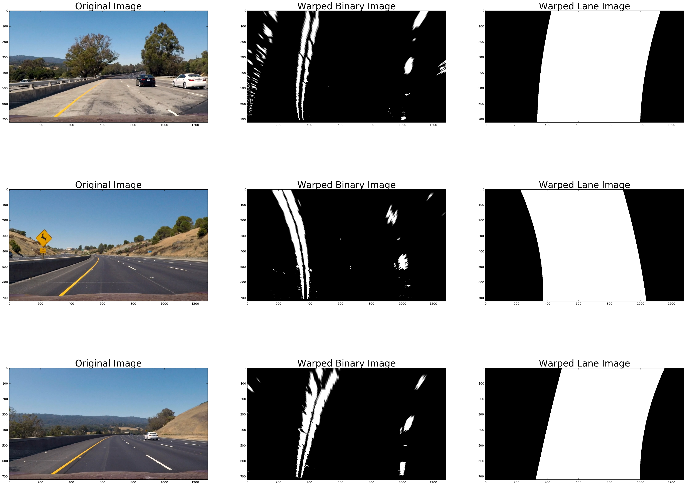

## Advanced Lane Finding

In this project, your goal is to write a software pipeline to identify the lane boundaries in a video, but the main output or product we want you to create is a detailed writeup of the project.  Check out the [writeup template](https://github.com/udacity/CarND-Advanced-Lane-Lines/blob/master/writeup_template.md) for this project and use it as a starting point for creating your own writeup.  

Camera calibration
---

* chess board image

* lane image - distortion correction

Color transform
---

* color transform image

Perspective transform
---

* perspective square finding image

* unwarped image

Rectified binary lane image - birds-eye view
---

* rectified binary lane image

Lane detection
---

* lane detection image

* lane detection process

Curvature and vehicle position
---

* calculation method

Lane marking
---

* lane marking image

Result (Video)
---

* output result image

* project video

* challenge video

* harder challenge video

Discussion?
---

If you're feeling ambitious (again, totally optional though), don't stop there!  We encourage you to go out and take video of your own, calibrate your camera and show us how you would implement this project from scratch!
